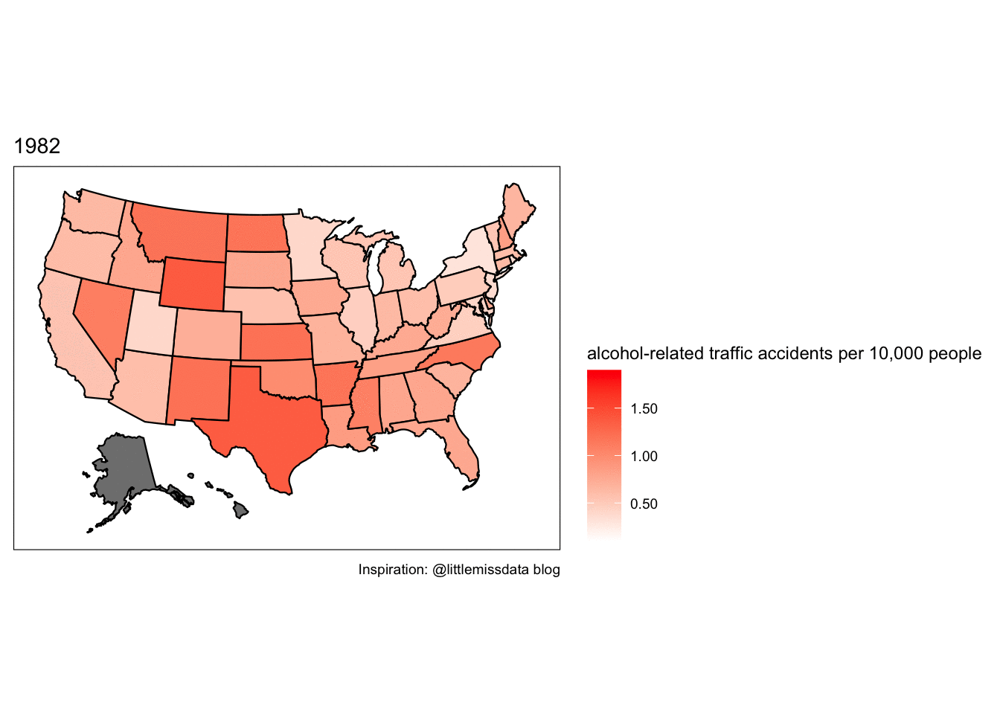
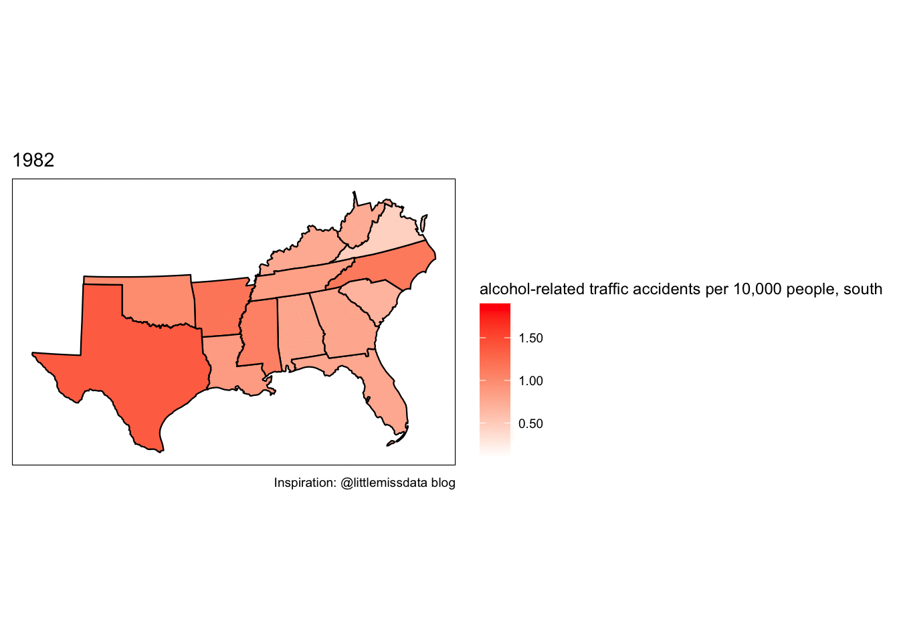
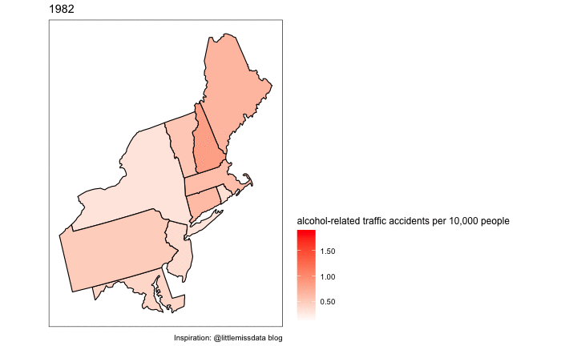

```{r global_options, include=FALSE, fig.align='center'}
knitr::opts_chunk$set(fig.pos='H', fig.align='center')
```

```{r,echo = FALSE, results = "hide", include=FALSE}
library(tidyverse)
library(dplyr)
library(AER)
library(agricolae)
library(lme4)
library(car)
library(DT)
library(plm)
library(GGally)
library(zoo)
library(gridExtra)
library(grid)
data(Fatalities)
```

***

# Abstract

Alcohol-related traffic fatalities account for over a quarter of traffic-related deaths in the United States, and are considered a public health crisis by some
(Perrine et al., 1989). Studies have shown a correlation between alcohol-related traffic accidents and the implementation of laws aimed towards reducing said accidents
(Lovenheim & Slemrod, 2010; Mast et al., 1999). Data regarding alcohol-related fatalities, population, and laws was collected for 48 states between 1982 and 1988. Our study analyzes this data to assesses the relationship between various state laws, such as alcohol tax, legal drinking age, and first-offense punishments, on alcohol fatality rates. Drinking age and state were both significantly correlated to alcohol-related traffic fatalities, suggesting that other state laws play a role in observed trends. We found these predictor variables to be the most important for the years 1982, 1985, 1988:
region, income (in 1987 dollars), jail sentence, average miles per driver, and number of spirits.
To determine the net effect of breathalyzer and first-offense punishment laws on fatalities rates, a fixed effect regression model was fit on the data holding state and year constant. The relationship varied across states. Beer tax does not have a causal relationship with alcohol-related fatalities. The results of this report could inform policy makers.

# Introduction

Traffic fatalities related to alcohol consumption are a significant cause of traffic-related death in the United States. In 2018, over 10,000 people died from crashes due to intoxicated driving, comprising nearly 30% of the year's traffic fatalities (National Highway Traffic Safety Administration). Some researchers have likened the impact of these deaths to a epidemiological issue given the complex social and cultural circumstances that surround drinking (Perrine et al., 1989). To help combat the problem, public representatives have implemented several different types of laws (Stock and Watson, 2007). These kinds of laws are broadly defined in this report as "decreasing opportunity", or "preventing recidivism". In other words, these laws either: make it less convenient (and theoretically, less probable) that one individual would drive drunk, or make the penalty so large for a first offense that a previous offender will correct their behavior the next time. Successful deterrence of driving-while-intoxicated has the potential to save the lives of many citizens.

In the 1980s, lawmakers implemented various laws related to, among other things, drinking age, beer tax and drunk driving penalties (Stock & Watson). The goal of this report is to study the efficacy of these law changes, across the United States, and over the course of the 1980s.

We address these questions:

 - Are any law changes (particularly beer tax, penalization for drunk driving, or drinking age) correlated with the improvement in alcohol-related traffic fatalities per capita?

 - Which combination of drunk-driving related variables in the data set best predict the rate of alcohol-related traffic fatalities?

 - Is it possible to imply causality between law implementation and a change in alcohol-related traffic fatalities?

We hypothesize that the rate of alcohol-related traffic fatalities will *not* be significantly correlated with drinking age, or a more-stringent sentencing for drunk driving offense (Perrine et al., 1989). We hypothesize that beer tax will be negatively correlated with the rate of drunk-driving fatalities. Insight regarding these these questions could help lawmakers assess the efficacy of drunk driving-related legislation on alcohol-related traffic fatalities.

# Background

The data used in this experiment was compiled by Stock and Watson for their 2007 Textbook "Introduction to Econometrics." This compilation allowed students to look at alcohol-related laws and their impact on drunk driving. This set is available through AER as the "Fatalities" data set, where it is more completely described (AER Package). The target population of the original data is all alcohol-related fatalities in the mainland 48 states during the 1980s. The population is reported from each state, along with statistics including total traffic fatalities, alcohol-related traffic fatalities by state. The "sampling" mechanism was reported accidents and fatalities available in the public domain. While some accidents may not have been reported (alcohol-related non-motor vehicle fatalities), it is relatively safe to presume that all instances were reported. Totals (for counts) or means (for values) associated with each variable were aggregated on a yearly basis by state. The variables used in this study include: "beer tax", "spirits", "drinking age", "breath indicator", "service", "jail", "miles", and "dry". "Beer tax" is the state tax imposed on beer. "Spirits" is the numeric representation of spirit consumption (higher alcohol content beverages). Drinking age is the age at which consuming or buying alcohol is legal. "Breath indicator", "jail" and "service" describe if the respective penalty is imposed in the state. Service and jail were combined into one score, known as "penalties". "Miles" is the average distance driven by a person living in that state per year. "Dry" represents the percentage of people living in a county that imposes includes alcohol restrictions.

## Descriptive Analysis 

The rate of alcohol-related drinking fatalities fluctuated by state over the 7 years included in this study. It appears that alcohol-related traffic fatalities decreases in most states over most year.

<center>

</center>

Preliminary analysis suggests that law-changes were similar between the southeastern-to-southcentral region and the northeastern-to-midatlantic region.

<center>


</center>

## Drinking Age
Based on reports from previous literature, drinking age seems to be a state's first-line of defense against alcohol-related traffic fatalities
(Lovenheim & Slemrod, 2010). Preliminary data exploration shows that by far, the most common drinking age is 21. Drinking age is significantly related to the rate of alcohol-related traffic fatalities (see table below. State, however, also appears to be significant. This is telling because it suggests that other state laws are significantly affecting drunk driving. Because the drinking age is now 21 across the nation, this variable does not contribute actionable information to this study. The other state laws may still be actionable and warrant further study. Diagnostics confirm that distribution of drinking age is not normal. Additionally, there is an outlier will undue pull (Louisiana in 1988).

The notation for the test performed (two-way ANOVA) to determine significance of drinking age and state is as follows:

$$Y_{ijk} = \mu_{\cdot\cdot} + \alpha_i+\beta_j + (\alpha\beta)_{ij}+\epsilon_{ijk}$$

such that $k=1,..., n, j=1,..., b, i=1,..., a$

where ${\epsilon_{ijk}}$ are i.i.d (independently and identically distributed), such that $N(0,\sigma^2)$.
Y is the alcohol-related vehicle fatalities, $\alpha$ is the effect due to i (minimum drinking age), $\beta$ is the effect due to j (state), $\mu$ is the overall mean response, and $\epsilon$ is the residual. k is the index from 1 to the number of rows of the data.

This formation of notation was adapted from STA207 [class notes](https://hub.gke2.mybinder.org/user/chenshizhe-statdatascience-ib1xrgdt/notebooks/Notes/Chapter4ANOVAII.ipynb), section 4.3. [This page](https://www.itl.nist.gov/div898/handbook/prc/section4/prc437.htm) was also referenced.

```{r, echo = FALSE}
drinking_age <- Fatalities$drinkage
alcohol_fat <- Fatalities$afatal
night_youth<- Fatalities$fatal1517
night_YA <- Fatalities$fatal1820
night_legal <- Fatalities$fatal2124

a_rate <-  (Fatalities$afatal/Fatalities$pop)*10000
Fatalities <- cbind(Fatalities,a_rate)
af=as.data.frame(Fatalities)#Christina's data

```

```{r, echo = FALSE}
hist(drinking_age, main = "Histogram of Legal Dinking Age", xlab = "Legal Drinking Age")
```
### add titles and axes lables to graphs?

```{r, echo = FALSE, results = "hide", warning=FALSE}
library(dplyr)
#plot(drinking_age,alcohol_fat)
#plot(drinking_age,night_youth)
#plot(drinking_age,night_YA)
#plot(drinking_age,night_legal)
#par(mfrow=c(2,2))

#alc_age <- lm(a_rate~as.factor(drinking_age))
#plot(alc_age)

Fatalities[281:283,]
newdata <- Fatalities[order(-Fatalities$afatal),]

#anova_fat <- aov(a_rate~as.factor(drinking_age), data = Fatalities)
#summary(anova_fat)


anova_fat_state <- aov(a_rate~as.factor(drinking_age)*as.factor(state), data = Fatalities)
anova_fat_state_sum <- summary(anova_fat_state)

Variable <- c("Drinking Age", "State","Interaction DrinkingAge:State")
FValue <- c(7.605,17.683,0.817)
PValue <- c("3.27e-11","<2e-16",0.772)
stat <- data.frame(Variable, FValue, PValue)

#from Christina
## remove options = list(sDom  = 't') to include the search and show entries pulldown!
datatable(stat,class = 'cell-border stripe',
 caption = htmltools::tags$caption(
    style = 'caption-side: top; text-align: center;',
    'Table X: ', htmltools::em('ANOVA: Alcohol-Related Traffic Fatalities in the entire USA')),options = list(sDom  = 't'), colnames= , rownames=)

#anova_fat_state <- aov(a_rate~as.factor(drinking_age)+as.factor(state), data = Fatalities)
#summary(anova_fat_state)


par(mfrow=c(2,2), oma=c(0,0,5,0))
plot(anova_fat_state,sub = NA)
mtext("Diagnostics for Drinking Age", side = 3, outer = TRUE, cex = 1)

Fatalities[112,]
#Fatalities[211,]
#Fatalities[which(Fatalities$state == "la"),]


south= Fatalities%>%filter(state %in% c("la","ms","al","ga","sc","ar","tx","fl","nc","tn","ar","ok","ky","wv","va"))
n_east= Fatalities%>%filter(state %in% c("me","vt","nh","ma","ny","ri","ct","nj","de","md","pa"))
```

```{r, echo = FALSE}
anova_fat_state_south <- aov(afatal~as.factor(drinkage)*as.factor(state), data = south)
anova_fat_state_south_sum <- summary(anova_fat_state_south)

Variable <- c("Drinking Age", "State","Interaction DrinkingAge:State")
FValue <- c(42.89,90.03,9.31)
PValue <- c("<2e-16","<2e-16",5.14e-09)
stat <- data.frame(Variable, FValue, PValue)

#from Christina
## remove options = list(sDom  = 't') to include the search and show entries pulldown!
datatable(stat,class = 'cell-border stripe',
 caption = htmltools::tags$caption(
    style = 'caption-side: top; text-align: center;',
    'Table X: ', htmltools::em('ANOVA: Alcohol-Related Traffic Fatalities in Southern Region')),options = list(sDom  = 't'), colnames= , rownames=)

anova_fat_state_north <- aov(afatal~as.factor(drinkage)*as.factor(state), data = n_east)
#summary(anova_fat_state_north)

Variable <- c("Drinking Age", "State","Interaction DrinkingAge:State")
FValue <- c(87.200,220.933,0.848)
PValue <- c("<2e-16","<2e-16",0.577)
stat <- data.frame(Variable, FValue, PValue)

#from Christina
datatable(stat,class = 'cell-border stripe',
 caption = htmltools::tags$caption(
    style = 'caption-side: top; text-align: center;',
    'Table X: ', htmltools::em('ANOVA: Alcohol-Related Traffic Fatalities in Northern Region')), colnames= )

anova_fat_state_n_nointeract <- aov(afatal~as.factor(drinkage)+as.factor(state), data = n_east)
#summary(anova_fat_state_n_nointeract)

```

## Inferential analysis

```{r, echo = FALSE, message=FALSE, results = 'hide'}
library(ggplot2)
library(viridis)
library(AER)
library(MASS)
data(Fatalities)
dim(Fatalities)

Fatalities$afatal_rate <- Fatalities$afatal / Fatalities$pop * 10000
## different us regions
south = c("la","ms","al","ga","sc","ar","tx","fl","nc","tn","ar","ok","ky","wv","va")
n_east =  c("me","vt","nh","ma","ny","ri","ct","nj","de","md","pa")

Fatalities$location[Fatalities$state %in% south]  =  "south"
Fatalities$location[Fatalities$state %in% n_east] =  "north east"
Fatalities$location[!(Fatalities$state %in% n_east | Fatalities$state %in% south)]   =  "other"
Fatalities$location = as.factor(Fatalities$location)

Fatalities = Fatalities[c("afatal_rate","year", "spirits", "unemp", "income", "emppop", "beertax",    "baptist", "mormon","drinkage","dry","youngdrivers","miles","breath","jail", "service", "milestot", "unempus", "emppopus","gsp", "location")]

#remove the missing value:
Fatalities = Fatalities[-c(which(is.na(Fatalities$jail))),]

fatality.1982 = subset(Fatalities, year == "1982")
fatality.1982$year = NULL
fatality.1985 = subset(Fatalities, year == "1985")
fatality.1985$year = NULL
fatality.1988 = subset(Fatalities, year == "1988")
fatality.1988$year = NULL
```
##  Model Selection\
In this section we are using stepwise regression for all subsets and a specific subset selection process to see which combination of explanatory variables will produce the best model based off of the criteria we have chosen to use which is BIC. There are many variables in our model and we must make sure the ones in our model are significant. We looked at the model chosen when using all subsets and then Forwards Backwards Selection.

##  Model Criteria\
Because our goal is to have a correct model, we are choosing only explanatory variables    which have a significant relationship with angina. This model may be smaller than ones which have the goal of prediction. For the purposes of this class AIC or BIC are often used as model selection criteria as they penalize large models. AIC may overfit correct models and BIC penalizes large models even more, so we chose to focus on BIC as we imagine if somebody is trying to see if a person has angina  they will really need the  result to be as correct as possible. We choose the model that lowers BIC the most.

## Subset Selection\
Subset selection does not evaluate all possible models; however, it is faster and does not cost as much because not all subsets are calculated. We chose to use Forwards Backwards Selection because we want a correct model which means having a smaller one. Of course, underfitting a model is not ideal however between underfitting and overfitting, underfitting the model is more likely to achieve the smaller and often more correct model which Forwards Selection or Forwards Backwards Selection is more likely to do. Forwards Backwards Selection does not underfit as much as Forwards Selection though, so we used Forwards Backwards as our subset selection. These were the models with the lowest BIC when looking at all possible models.
```{r, results = "hide",include=FALSE}
#used get best model fun from model_selection.R file
best.model.1982 = lm(formula = afatal_rate ~ location + miles + dry + jail + spirits,
    data = fatality.1982)
best.model.1985 = lm(formula = afatal_rate ~ location + income + miles + jail,
    data = fatality.1985)
best.model.1988 = lm(formula = afatal_rate ~ location + income + baptist, data = fatality.1988)
```
<div align="center">
Model 1 : $$ Y_{1982} =  -0.7118 + 0.1313X_{region, other} + 0.1711X_{region, south} + 0.0002X_{miles} +0.0113X_{dry} + 0.2154X_{jail,yes} +  0.0888X_{spirits}$$

Model 2: $$ Y_{1985} =  0.56308 - 0.0094X_{region, other} + 0.0781X_{region, south} - 0.00004X_{income} + 0.00008X_{miles} + 0.13960X_{jail,yes}$$

Model 3: $$ Y_{1988} =  1.35883 - 0.01927X_{region, other} - 0.15759X_{region, south} - 0.00005X_{income} + 0.01255 X_{baptist}$$


## Diagnostics
With our “best” models of no interaction effects, we will perform diagnostics to ensure that it meets the assumptions of multiple regression, which are that observations are independent, errors have constant variance and they are normally distributed. We will look at different tests for these assumptions, and find and remove outliers. If necessary. we will transform data to correct for non-normality, non-linearity, or non-constant variance

### Testing for Normality
```{r, echo = FALSE}
plot_qq = function(M, y){
qqnorm(M$residuals, main = sprintf("QQPlot %s", y))
qqline(M$residuals)
}
par(mfrow = c(2,2))
plot_qq(best.model.1982, "Model 1")
plot_qq(best.model.1985, "Model 2")
plot_qq(best.model.1988, "Model 3")
```

This data does not seem to be normally distributed as there are heavy tails on all three models. There are outliers and the points towards the end of the line are not where the points would lie if the data was totally normally distributed.

### Shapiro Wilks Test
```{r, results = "hide",include=FALSE}
check.normality.assumptions = function(M){
  #qqnorm(M$residuals)
  #qqline(M$residuals)
  the.SWtest = shapiro.test(M$residuals)
  pValue = the.SWtest$p.value
  if (pValue < (0.01|0.05|0.1)){
    bc = boxcox(M,plotit = FALSE)
    lambda = bc$x[which.max(bc$y)]
    lambda #To see the value of lambda, transform to ln(y)

  results = list("p-value" = pValue, "lambda" = lambda)
  return(results)
  }
}
check.normality.assumptions(best.model.1982)
check.normality.assumptions(best.model.1985)
check.normality.assumptions(best.model.1988)
```


$H_{o}:$ errors is  normal   $H_{A}:$ errors is non- normal

   $P-Value_{model\ 1}:  0.2426$     $P-Value_{model\ 2}:  0.02156$     $P-Value_{model\ 3}:  0.0024$

The p-values for model 1 and 2 are greater than an alpha of 0.01. Thus we fail to reject the null and conclude that the errors are normally distributed. However, for model 3 the p-value is less than any significant alpha of 0.01, 0.1 and 0.05 thus we reject the null and conclude that the errors are not normally distributed.

### Testing for constant variance
####  Errors vs Fitted Values
```{r, echo = FALSE}
plot_err_vs_fit = function(M,y){
plot(M$fitted.values, M$residuals, main = sprintf("Error vs Fitted Value %s", y), xlab = "Fitted Values",ylab = "Errors")
abline(h = 0,col = "purple")
}
par(mfrow = c(2,2))
plot_err_vs_fit(best.model.1982, "Model 1")
plot_err_vs_fit(best.model.1985, "Model 2")
plot_err_vs_fit(best.model.1988, "Model 3")
```

There are many more data points on the lower values of X and a couple of outliers, but the data points are somewhat in a “band” around 0.

#### Breusch-Pagan Test
```{r,results = 'hide',include=FALSE}
bptest(best.model.1982)
bptest(best.model.1985)
bptest(best.model.1988)
```

$H_{o}:$ Residuals have equal variance   $H_{A}:$ Residuals do not have equal variance

   $P-Value_{model\ 1}$: 0.6729    $P-Value_{model\ 2}$: 0.1003      $P-Value_{model\ 2}$: 0.03305

All the models have a p-value greater than an alpha of 0.01 thus we fail to reeject the null and conclude that all the models have constant variance.

### Transformations for Model 3
In this section we will transform the data of Model 3 to try to correct for non-normality in the errors using the Box-Cox transformation. Box-Cox transformations uses $(Y^\lambda−1)/\lambda$ to find the lambda that maximizes log-likelihood. We found that the lambda that maximizes the log- likelihood has a value o zero which corresponds to a log transformation. Once we transform the data, we will re-fit model 3.  We chose to use the transformed data for Model 3  because that one made the data most linear, most normal, and has the most constant variance compared to no transformation. Our next step was to look for and remove any outliers so that we could further meet the assumptions of linear regression. We did find 2 outliers in model 2 and two outliers in Model 3, when using an alpha of 0.05. We also checked for leverage points, which are data points which have a large influence on the regression line. When using cook’s distance  there were no leverage points, and so in the end we concluded to not remove any data points because the outliers are not influencing the models.

```{r,  echo=FALSE}
transformData = function(data){
  data$afatal_rate = log(data$afatal_rate)
  return(data)
}
new.fatality.1988 = transformData(fatality.1988)
```
```{r,echo=FALSE, results="hide"}
new.best.model.1988 = lm(formula = afatal_rate ~ location + income + miles, data = new.fatality.1988)
shapiro.test(new.best.model.1988$residuals)
bptest(new.best.model.1988)

outliers = function(Model, data){
  ri = rstandard(Model)
  alpha = 0.1
  n = nrow(data)
  p = length(Model$coefficients)
  cutoff = qt(1-alpha/(2*n), n - p )
  outliers = which(abs(ri) > cutoff)
  return(outliers)
}

outliers(new.best.model.1988, new.fatality.1988)
outliers(best.model.1982,fatality.1982)
outliers(best.model.1985,fatality.1985)

all.values = influence.measures(new.best.model.1988)$infmat
colnames(all.values)
p = new.best.model.1988$coefficients
n = nrow(new.best.model.1988)
lev.DF = which(all.values[,"cook.d"] >qf(0.50,p,n-p))

all.values = influence.measures(best.model.1985)$infmat
lev.DF = which(all.values[,"cook.d"] >qf(0.50,p,n-p))
lev.DF
```

### Final Models
After verifying the assumptions and performing transformations, we can conclude that the assumptions of normality and constant variance are met for all models and no outliers need to be removed. Thus the best models are:

$$ Y_{1982} =  -0.7118 + 0.1313X_{region, other} + 0.1711X_{region, south} + 0.0002X_{miles} +0.0113X_{dry} + 0.2154X_{jail,yes} +  0.0888X_{spirits}$$


$$ Y_{1985} =  0.56308 - 0.0094X_{region, other} + 0.0781X_{region, south} - 0.00004X_{income} + 0.00008X_{miles} + 0.13960X_{jail,yes}$$

$$ ln(Y_{1988}) = -0.3367+ 0.0190X_{region, other} + 0.1032X_{region, south} - 0.0001X_{income} + 0.0001 X_{miles}$$

### Interpretation and Analysis

#### A. Models

**(i)** Model 1: $\hat{\beta_{7}}:$ When spirit consumption increases by 1 bottle, the average number of alcohol fatalities increases by 1396 accidents holding all other variables constant

**(ii)** Model 3: $\hat{\beta_{3}}$ Souhtern states had  11087 more alcohol fatalities on average compared to  north eastern states, holding all other variables constant. In other words,


## Fixed Regression Models for State Laws

To assess whether state implemented laws had a significant effect on alcohol related vehicle fatalities, we first must subset our data. It is unrealistic to expect the demographic and political priorities of each state is equivalent. In a attempt to address this discrepancy, we have decided to investigate the effectiveness of jail, service, and breath laws in the Southern and North Eastern regions of the United States.


In the case of this model, it is important to recognize the factorial variables jail and service indicate whether a first-time drunk driving offense leads to subsequent jail time or mandatory community service. Since both service and jail time are regarded as punishments, they are combined into a single factorial called penalty. The breath factorial indicates whether that state currently has a law in place to allow officers to perform breath tests on drivers they pulled over. Intuitively, each of these factorials appear to deter drunk driving under the assumption that the information from each state is homogeneous and fully reported. 

In many ways, this is wishful thinking, as there are factors not included in this data set such as vehicle sales, road quality, and number of bars per area, etc,.

The following graphs illustrate this point. In most all cases, once a state implemented a breath test or penalty law, it did not revoke it in the years which followed. The state fatality rates were graphed for the starting year 1982 and ending year 1988. The points were color and shape coded to indicate year and whether a breath test or penalty law was in place. There is no clear pattern on whether either of these laws had any effect when we compare to other states. It is more reasonable to suggest the effect will be different due to state differences. That is, there is no simply way to determine the net effect of either law on fatality rates between even neighboring states. 


```{r, echo = FALSE, include=FALSE, results="hide"}
 data(Fatalities)
af=data.frame(Fatalities)
af$rate=(af$afatal/af$pop)*10000

af$penalty <- with(af, factor(jail == "yes" | service == "yes",
labels = c("no", "yes")))

southa= af%>%dplyr::filter(state %in% c("la","ms","al","ga","sc","ar","tx","fl","nc","tn","ok","ky","wv","va"))


n_easta= af%>%dplyr::filter(state %in% c("me","vt","nh","ma","ny","ri","ct","nj","de","md","pa"))
```


```{r echo=FALSE, fig.length=15, fig.width=15}

southa_graph = southa%>%filter(year%in% c("1982","1988"))

s_pean=ggplot(southa_graph, aes(factor(state), rate )) + geom_point(aes(shape = factor(year),color=factor(penalty)),size=5 )+labs(x="State", y="Fatality Rate",
       col="Penalty",shape="Year",title="Fatality Rate and Penality Policy 82,88")+  theme(legend.position='bottom',text = element_text(size=14,face = 'bold'),
        axis.text.x = element_text(angle=75, hjust=1),axis.ticks.x = element_line(size=0.5))+scale_x_discrete(guide = guide_axis(n.dodge = 1),expand=c(0, 0))+  scale_color_manual(labels = c("No", "Yes"), values = c("red", "green"))+ geom_line()


s_breath=ggplot(southa_graph, aes(factor(state), rate )) +
  geom_point(aes( shape =factor(year),color=factor(breath)),size=5 )+geom_line()+
  labs(x="State", y="Fatality Rate", col="Breath",shape="Year",title="Fatality Rate and Breath Test Policy 82,88")+
  theme(legend.position='bottom',text = element_text(size=14,face = 'bold'),
        axis.text.x = element_text(angle=75, hjust=1),axis.ticks.x = element_line(size=0.5))+scale_x_discrete(guide = guide_axis(n.dodge = 1),expand=c(0, 0))+  scale_color_manual(labels = c("No", "Yes"), values = c("red", "green"))


grid.arrange(s_pean, s_breath, ncol=2, top = textGrob("Southern States",gp=gpar(fontsize=40,font=2)))

```

```{r echo=FALSE, fig.length=15, fig.width=15}


northa_graph = n_easta%>%filter(year%in% c("1982","1988"))

n_pean=ggplot(northa_graph, aes(factor(state), rate )) + geom_point(aes(shape = factor(year),color=factor(penalty)),size=5 )+labs(x="State", y="Fatality Rate",
       col="Penalty",shape="Year",title="Fatality Rate and Penality Policy 82,88")+  theme(legend.position='bottom',text = element_text(size=14,face = 'bold'),
        axis.text.x = element_text(angle=75, hjust=1),axis.ticks.x =element_line(size=0.5))+scale_x_discrete(guide = guide_axis(n.dodge = 1),expand=c(0, 0))+  scale_color_manual(labels = c("No", "Yes"), values = c("red", "green"))+ geom_line()


n_breath=ggplot(northa_graph, aes(factor(state), rate )) +
  geom_point(aes( shape =factor(year),color=factor(breath)),size=5 )+geom_line()+
  labs(x="State", y="Fatality Rate", col="Breath",shape="Year",title="Fatality Rate and Breath Test Policy 82,88")+
  theme(legend.position='bottom',text = element_text(size=14,face = 'bold'),
        axis.text.x = element_text(angle=75, hjust=1),axis.ticks.x = element_line(size=0.5))+scale_x_discrete(guide = guide_axis(n.dodge = 1),expand=c(0, 0))+  scale_color_manual(labels = c("No", "Yes"), values = c("red", "green"))


grid.arrange(n_pean, n_breath, ncol=2, top = textGrob("Northeastern States",gp=gpar(fontsize=40,font=2)))

```


Fortunately, the fixed effects regression model can be implemented to determine the net effect of breath tests and penalty laws by holding state and year constant. The fixed effect model seeks to account for variability within year and state, and allows us to work with data which changes overtime while reducing the bias which results from data with out said change. Therefore, we assume there are influential factors within each state and year not accounted for in the observed data. For this model, we will be predicting on the log transformation of the fatality rate.

In the fixed model:

$$Y_{it} = \beta_0 + \beta_1 X_{1,it} +\cdots+\beta_1 X_{k,it} + \gamma_2 E2 +\cdots + \gamma_n En + \delta_2 D2 + \cdots +  \delta_T DT + u_{it} .$$

where $t=1,...,T$ represents the year (time) and $i=1,...,n$ represents the collection of instances for each state $i$ (entity).

There are n-1 dummy variables for states.
$Ei$ represents the binary dummy variable which accounts for the fixed effect of state $i$ with its respective coefficient $\gamma_i$.

There are T-1 dummy variables for years
$Dt$ represents the binary dummy variable which accounts for the fixed effect of year $t$ with its respective coefficient $\delta_t$.

Notice how the dummy variables $\gamma_1 E1$ and $\delta_1 D1$ are not shown in our model. These dummy variables are represented when all other dummy variables for that type are zero. For example, $\gamma_1 E_1$ is represented when $\gamma_2 E2= \cdots =\gamma_n EN=0$

$u_{it}$ represents the error terms and $\beta_1 X_{k,it}$ represents the $kth$ predictor.

For the fixed effects model, the following assumptions are made:

- The error terms when conditioned on the aggressors, have a mean equal to zero, that is, $E(u_{it}|X_{1,it},\cdots,X_{k,it})=0$
- The regressor terms and errors for all $i=1,\cdots,n$ are $i.i.d.$ from their joint distribution.

- There is no perfect multicollinearity

- There are not significant outliers

 A simpler, project specific version of the model using only BreathTest and Penalty for regressiors is:

  $$\hat{FatalityRate}_{State, Year} = \beta_1  X_{Penalty :\ Yes} + \beta_2  X_{Breath \ Test: \ Yes} + StateEffects_{State} + TimeEffects_{Year}+ errors_{State, Year}$$

 In this form of the model the intercept $\beta_0$ is incorporated within $StateEffects_{State} + TimeEffects_{Year}$.


 Below we calculate the cluster standard errors to test the significance of our estimates at level $\alpha=0.05$. The usage of cluster standard errors is to adjusts for serial correlation and heteroskedasticity which can invalidate standard error calculations in fixed effect regression models.
 
 The results of a fixed linear regression model on all states shows no significant effect of BreathTests or Penalty laws on drunk driving. However, as noted prior, it is unlikely that even a panel model on all fifty-states can correctly adjust for the unobsrved differences between each state and year.

```{r echo=TRUE}
pan.total <- plm(log(rate
) ~ penalty +breath+ state + year,
index = c("state", "year"),
model = "within",
effect = "twoways",
data = af)
coeftest(pan.total, vcov = vcovHC, type = "HC1")

```


The fixed regression model using southern states indicates that a Penality does effect fatality rates to a significance level of $\alpha=0.05$. Unfortunately, the existence of a Penality appears to increase fatality rates while BreathTests are in-significant.

```{r,echo = FALSE,results="hide", include=FALSE}

pan.south <- plm(log(rate
) ~penalty+breath+ state + year,
index = c("state", "year"),
model = "within",
effect = "twoways",
data = southa)

coeftest(pan.south, vcov = vcovHC, type = "HC1")
```

When using northern states there appears to be a significant negative net effect of both BreathTest and Penalities on fatality rates. It is possible the effect appears in this model because in general northern states have less land area than southern states, so the odds of encountering a police officer who will enforce these laws is greater.  

```{r echo=TRUE, results="hide"}

pan.north <- plm(log(rate
) ~ penalty+breath+state + year,
index = c("state", "year"),
model = "within",
effect = "twoways",
data = n_easta)


coeftest(pan.north, vcov = vcovHC, type = "HC1")

```


Diagnostic plots for each of the three laws models indicates the residuals are independently distributed with no clear pattern to indicate non-linearity.
The Q-Q chart indicate the error terms are normally distributed $N(0,\sigma^2)$ for each of the models with light tails. 

```{r Diagnostics,echo = FALSE }
fit_vals <- function(mod) {
   return (as.numeric(mod$model[[1]] - mod$residuals) )
}

par(mfrow=c(1,2),oma = c(0, 0, 2, 0))
plot(fit_vals(pan.total), pan.total$res, main="Residuals vs Fitted", xlab="Fitted Values", ylab="Residuals")
abline(lm(pan.total$res~fit_vals(pan.total)), col="red")

qqnorm(pan.total$res)
qqline(pan.total$res)
mtext("Diagnostic Plots All States", outer = TRUE, cex = 1.5)

```
```{r,echo = FALSE}
par(mfrow=c(1,2),oma = c(0, 0, 2, 0))
plot(fit_vals(pan.south), pan.south$res, main="Residuals vs Fitted", xlab="Fitted Values", ylab="Residuals")
abline(lm(pan.south$res~fit_vals(pan.south)), col="red")

qqnorm(pan.south$res)
qqline(pan.south$res)

mtext("Diagnostic Plots Southern States", outer = TRUE, cex = 1.5)

```
```{r, echo = FALSE}
par(mfrow=c(1,2),oma = c(0, 0, 2, 0))


plot(fit_vals(pan.north), pan.north$res, main="Residuals vs Fitted", xlab="Fitted Values", ylab="Residuals")
abline(lm(pan.north$res~fit_vals(pan.north)), col="red")

qqnorm(pan.north$res)
qqline(pan.north$res)

mtext("Diagnostic Plots North Eastern States", outer = TRUE, cex = 1.5)

```

## Alcohol Consumption

In addition to examining how laws impact the alcohol-related fatality rate, we will see if alcohol consumption has any affect on this statistic.
The Fatalities dataset gives us access to spirit consumption per state and also beer taxes, which we will use as a proxy for beer consumption.
By using beer taxes as a proxy for beer consumption, we assume that higher beer taxes lead to less consumption (negative correlation).
Note that we will need to validate this assumption in order for any dependent results to be conclusive.

For these variables, we have two hypotheses about the variables' affects on one another:

  1. Beer taxes will have a *positive relationship* with spirit consumption; As taxes on beer go up one becomes deterred from purchasing beer, and their likelihood of alternatively choosing spirits goes up.
  2. Fatality rate has a *negative relationship* with beer taxes.

### Model

We plan on using a two-way linear model, so we will first look at the pair plots of our observations and outcome:

```{r, echo=FALSE}
Fatalities$afatalper10k <- (Fatalities$afatal / Fatalities$pop) * 10000
Fatalities$afatalper100kmiles <- (Fatalities$afatal / Fatalities$milestot) * 100000
Fatalities <- Fatalities[c("year", "state", "spirits", "beertax", "afatalper10k")]
avg_fatalities <- aggregate(.~state, Fatalities[c("state", "spirits", "beertax", "afatalper10k")], mean)
# head(avg_fatalities)
ggpairs(
  avg_fatalities[c("spirits", "beertax", "afatalper10k")],
  title="Alcohol Consumption Pair Plot",
  columnLabels=c("Spirit Consumption", "Beer Taxes", "Fatalities Per 10k Citizens")
)
```

At first glance, spirit consumption does not appear to have any correlation with beer taxes.
More notably, there is a positive correlation between beer taxes and fatalities, the opposite of what we hypothesized.
We can confirm these observations in our models.

For our models we will be testing an interaction term to see if it makes any difference in the outcome.
The notation for our two models are as follows:

```{r, echo=FALSE}
full_model <- lm(afatalper10k ~ beertax + spirits + beertax * spirits, avg_fatalities)
reduced_model <- lm(afatalper10k ~ beertax + spirits, avg_fatalities)
full_coef <- summary(full_model)$coefficients
reduced_coef <- summary(reduced_model)$coefficients
```

$$Y_{full} = `r full_coef[1,1]` + `r full_coef[2,1]`X_{beertax} - `r abs(full_coef[3,1])`X_{spirits} - `r abs(full_coef[4,1])`X_{beertax}X_{spirits}$$
$$Y_{reduced} = `r reduced_coef[1,1]` + `r reduced_coef[2,1]`X_{beertax} - `r abs(reduced_coef[3,1])`X_{spirits}$$

<center>
Coefficients summaries for the full model
```{r, echo=FALSE}
as.data.frame(full_coef)
```

Coefficients summaries for the reduced model
```{r, echo=FALSE}
as.data.frame(reduced_coef)
```
</center>

The p-value for the interaction term in our reduced model is `r round(full_coef[4,4], digits=2)` so we can say that the interaction term has no effect and we should use the reduced model.

Looking at the reduced model parameters, we can check to see if our initial hypotheses are true.

* With a p-value of `r round(reduced_coef[3,4], digits=2)` it looks like **spirit consumption has no effect on alcohol-related fatalities**.
* We can see that **beer taxes do have an effect on alcohol related fatalities** with that term having a p-value of `r round(reduced_coef[2,4], digits=4)`.
*However*, this result is the opposite of our hypothesis because the coefficient is positive, meaning as beer taxes increase the number of alcohol-related fatalities also increases.

Neither of our hypotheses were true, and the reverse of our expectation on beer taxes is quite interesting.
This observation contradicts the logic we used in our hypothesis so we will look into this further after the diagnostics section.

### Diagnostics

Plotting the diagnostic measures for our

```{r, echo=FALSE}
par(mfrow = c(1,2))
plot_qq(reduced_model,"Red. Model")
plot_err_vs_fit(reduced_model,"Red. Model")
```

#### Test for Normality
```{r, echo = FALSE}
check.normality.assumptions(reduced_model)$`p-value`
```

#### Test for Constant Variance
```{r, echo = FALSE}
bptest(reduced_model)$p.value
```

### Addressing Concerns

Although our intiail model identified a relationship between beer taxes and alcohol-related fatality numbers, it is not what we expected.
The positive relationship between these two variables seems counterintuitive at first; If beer costs more to buy, wouldn't that deter consumption and thus lead to fewer associated traffic fatalities?
This initial assumption we made does not appear to hold based on these results.

That being said, what explains this relationship?
Although it is clear that beer taxes cannot be used as a proxy for beer consumption, we can still infer that higher beer consumption has a positive relationship with alcohol-related traffic fatalities.
That being said, our next hypothesis is that *the relationship between beer taxes and fatalities is a non-causal relationship*.
Our guess is that each state's government imposes beer taxes based on the amount consumsed because the consumption rate is unaffected ny price changes.

To test this causal relationship we will look at the same variables as a year-over-year difference as opposed to a mean aggregation over every year.
This will allow us to see how the alcohol related fatalities responds to changes in beer taxation.
Based on our hypothesis, our expectation is that there is no relationship between the yearly change of these variables.

To start we will look at a pair plot of the same variables, but for year-over-year changes instead of overall state averages:

```{r, echo = FALSE}
# Try examining YoY changes
Fatalities$year <- as.Date(ISOdate(Fatalities$year, 12, 31))  # Convert year column to date type
# head(Fatalities)
by_state <- split(Fatalities, Fatalities$state)

Fatalities_diff <- by_state[[1]][0,]  # Empty DF
Fatalities_diff$state <- as.factor(NULL)

for (state_data in by_state) {
    zoo_state_data <- zoo(state_data[,-1:-2], order.by=state_data[,1])
    diff_df <- as.data.frame(diff(zoo_state_data))
    diff_df$state <- state_data$state[-1]
    diff_df$year <- state_data$year[-1]
    Fatalities_diff <- rbind(Fatalities_diff, diff_df)
}

Fatalities_diff <- Fatalities_diff[,c(5, 4, 1, 2, 3)]
# head(Fatalities_diff, 20)
ggpairs(
  Fatalities_diff[c("spirits", "beertax", "afatalper10k")],
  title="Year-Over-Year Alcohol Consumption Differences",
  columnLabels=c("Spirit Consumption", "Beer Taxes", "Fatalities Per 10k Citizens")
)

# Model for all states
# summary(lm(afatalper10k ~ beertax + state, Fatalities_diff))
```

Looking at these pair plots, it appears that there isn't much correlation between any of our variables.
To quantify this, we will use

```{r,echo = FALSE}
beertax_plm <- plm(
    afatalper10k ~ beertax + state + year,
    index=c("state", "year"),
    model="within",
    effect="twoways",
    data=Fatalities_diff
)

summary(beertax_plm)
coeftest(beertax_plm, vcov=vcovHC, type="HC1")
```

# Causal Inference

# Conclusion

This project examines the relationship between state-level policies (particularly drinking age, penalties, and beer tax) and the number of alcohol-related traffic fatalities in the United States.

- Findings in the inferential analysis interpreted in the context of Fatalities.

- Caveats of the current analysis.

Since now the nation-wide drinking age in the United States is 21, drinking age is no longer a relevant strategy for drunk driving prevention. Beer tax does not seem to impact alcohol fatalities, which reflects the findings in previous literature (Mast et al. 1999). They found that beer tax does not impact the heaviest drinkers, which is why it may not translate well as a prevention.
This is a public health/epidemiology issue not just a public policy issue. Psychologists, medicine, addiction and trauma counselors may also have role in this above and beyond policy makers (Perrine et al., 1989).

# Acknowledgement {-}

<span style='color:blue'>
This project has only been discussed within the group.
</span>

# Reference {-}

(Chi et al., 2011)

Chi, G., Zhou, X., McClure, T. E., Gilbert, P. A., Cosby, A. G., Zhang, L., Robertson, A. A., & Levinson, D. (2011). Gasoline prices and their relationship to drunk-driving crashes. Accident; analysis and prevention, 43(1), 194–203. https://doi.org/10.1016/j.aap.2010.08.009


[Relationship between gasoline prices and drunk driving crashes](https://www.sciencedirect.com/science/article/pii/S0001457510002423?casa_token=jpNEjTLZTRAAAAAA:jfG4LsqTxl3xxVb8DihHfrBd0wrACz9922VQxe4OR1QczbXWLlyn11I0F7YWM0w1rgPdvdz_) This could be interesting for discussion. It also contains some statistics about unemployment, which is why it was included.


(Ferguson, 2012)

Ferguson S. A. (2012). Alcohol-impaired driving in the United States: contributors to the problem and effective countermeasures. Traffic injury prevention, 13(5), 427–441. https://doi.org/10.1080/15389588.2012.656858

[A historical review on drunk driving in the US](https://www.tandfonline.com/doi/full/10.1080/15389588.2012.656858?casa_token=nukMm9C_XSIAAAAA%3AbrRhZXddGjRjHEJXhjC6vXDTvdS1-THbcz1Af-geGmpLhRFflTGzo1dzQEX4CIj5OCWZywjsnTg) What has worked, and what hasn't? This will be an important contribution to the discussion section, as we can compare our results (Whatever they may be) to this comprehensive review.


(Lovenheim & Slemrod, 2010)

Lovenheim, M. F., & Slemrod, J. (2010). The fatal toll of driving to drink: the effect of minimum legal drinking age evasion on traffic fatalities. Journal of health economics, 29(1), 62–77. https://doi.org/10.1016/j.jhealeco.2009.10.001

[The fatal toll of driving to drinkL the effect of minimal legal drinking age evasion on traffic fatalities](https://www.sciencedirect.com/science/article/pii/S016762960900112X?casa_token=RO1Xe8NlkFEAAAAA:q0IMnVgFl-6EUnHrFi9i1_eGHk3N72DKVBFxnIyYzq0VfdcRoYhkSTyjjIX9qrjz6LkUszEj) This covers the issues of teens drinking and driving with a really cool GIS approach that looks at regions. Discusses the evasion of laws.


(Mast et al., 1999)

Mast, B., Benson, B., & Rasmussen, D. (1999). Beer Taxation and Alcohol-Related Traffic Fatalities. Southern Economic Journal, 66(2), 214-249. doi:10.2307/1061141

[Beer taxation and Alcohol-related Traffic Fatalities](https://www.jstor.org/stable/1061141?casa_token=zFtQmEbeY_QAAAAA%3Af0JjUHvopvXG5WVl3ikDgWv863taJwuVu7kkAitlUq_bntLuMhLU7wJ8FQpv_Ajm2AOgLeZEoFDKbvuawzbt7SI5pc1w4xgPC1gcf_iIMwRNR6rXmw&seq=1#metadata_info_tab_contents ) This study explores the relationship between beer taxation and alcohol related Fatalities before 1996.


(NHTSA, 2021)

Drunk driving. (2021, January 12). Retrieved February 12, 2021, from https://www.nhtsa.gov/risky-driving/drunk-driving


[National Highway Traffic Safety Administration](https://www.nhtsa.gov/risky-driving/drunk-driving)


(Perrine et al., 1989)

Perrine, M. & Peck, Raymond & Fell, James. (1989). Epidemiologic Perspectives on Drunk Driving.

[Drunk driving from an epidemiology perspective](https://www.researchgate.net/profile/James_Fell2/publication/242431276_Epidemiologic_Perspectives_on_Drunk_Driving/links/00b4953720449b1137000000.pdf) Published in the 80s, helps define the public health aspect of this question and conundrum.


(Ruhm, 1996)

Ruhm, C. J. (1996). Alcohol Policies and Highway Vehicle Fatalities. Journal of Health Economics, 15, 435–454.


(Stock & Watson, 2007)

Stock, J. H. and Watson, M. W. (2007). Introduction to Econometrics, 2nd ed. Boston: Addison Wesley.


(Taxman & Piquero, 1998)

Taxman, F. S., & Piquero, A. (1998). On preventing drunk driving recidivism: An examination of rehabilitation and punishment approaches. Journal of Criminal Justice, 26(2), 129–143. https://doi.org/10.1016/S0047-2352(97)00075-5

[Preventing Recidivism](https://www.sciencedirect.com/science/article/pii/S0047235297000755?casa_token=dYkm8bDafQYAAAAA:TvYyDbQ4SjB1OCIYKqp-AW8Dhr5OYSKp3aSmhLullPouRIimEjff3vFFJ7Lxyz4uxYOEiXMF)
More thoughts on non-jail ways that drunk driving can be curbed and fatalities lowered. A bit tangential.


# GitHub Repository\
(https://github.com/cmdecesaris/207-Project-2/blob/main/Final_Document_for_Compilation.Rmd)


# Session info {-}

<span style='color:blue'>
Report information of your `R` session for reproducibility.
</span>

```{r}
sessionInfo()
```
