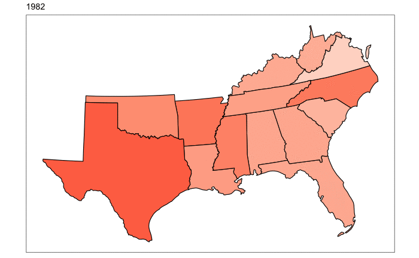

```{r global_options, include=FALSE}
knitr::opts_chunk$set(fig.pos = 'H')
```

***

# Abstract 

Alcohol-related traffic fatalities are a serious issue in the United States, considered a public health crisis by some (Perrine, Peck, Fell). Studies have shown that the decisions of policy makers to implement laws to protect their citizens from alcohol-related traffic accidents have correlated with improvement in such accidents (Lovenheim, Slemrod; Mast, Benson, Rasmussen). This study assesses the relationship between various state laws, including alcohol tax, legal drinking age, and punishments for driving-wile-intoxicated, on alcohol fatality rates. WHAT METHODS WE USED (1 SENTENCE). WHAT WERE THE RESULTS (2 SENTENCES).

# Introduction

Traffic fatalities related to alcohol consumption is a big problem in the United States. Over 10,000 people died from crashes due to driving while intoxicated in 2018, comprising nearly 30% of traffic fatalities that year. Some have likened the impact of these deaths to a public health, or epidemiological, problem given the complex social and cultural circumstances that surround this problem.  (https://www.nhtsa.gov/risky-driving/drunk-driving cite this last two sentences). Public representatives have implemented several different types of laws to help combat this problem. These laws can be broadly defined as "decreasing opportunity", or "preventing recidivism". In other words, these laws either: 1) make it less convenient (and theoretically, less probable) that one individual would drive drunk, or 2) make the penalty so large for a first offense that a previous offender will correct their behavior the next time. Successful deterrence of driving-while-intoxicated has the potential to save the lives of many citizens. 

In the 1980s, faced with the stark statistics, lawmakers implemented various laws related to, among other things, drinking age, beer tax and drunk driving penalties (cite). These laws were accumulated and described in a data set that will be discussed in greater detail later in this report. (cite our data set) The goal of this report is to study the efficacy of these law changes, across the United States, and over the course of the 1980s. In particular:
- Are any law change (particularly beer tax, penalization for drunk driving, or drinking age) correlated with the improvement in alcohol-related traffic fatalities per capita?
- Which combination of drunk-driving related variables in the data set best predict the rate of alcohol-related traffic fatalities?
- Is it possible to imply causality between these changes and the decrease or increase of alcohol-related traffic fatalities?

Based on previous literature, we hypothesize that lower alcohol-related traffic fatality rates will be correlated to a higher drinking age, higher beer tax, and more-stringent sentancing for drunk driving offenses. (cite ALSO ADD?) Better understanding the answers to these questions could help lawmakers assess the efficacy of drunk driving-related legislation on alcohol-related traffic fatalities. 
 
# Background 

The source of data used in this experiment is from a study conducted *then* by *them* to look at alcohol-related laws and their impact on drunk driving. This set is available through AER as the "Fatalities" data set. The target population of the original study was all 50 states in the USA, during the 1980s. The population is reported from each state, along with statistics including total traffic fatalities, alcohol-related traffic fatalities, and subsets of those variables separated by age. The "sampling" mechanism was reported accidents and fatalities available in the public domain. While some accidents (minor, on private property, or no injuries for instance) may not have been reported, it is relatively safe to presume that all instance were reported. Totals (for counts) or means (for values) associated with each variable were aggregated on a yearly basis by state. The variables used in this study include:FILL IN ONCE WE KNOW.

# Descriptive analysis 

The rate of alcohol-related drinking fatalities fluctuated by state over the 7 years included in this study. It appears that alcohol related traffic fatalities decreases in most states over most year.


Preliminary analysis suggests that law-changes were similar between the southeastern-to-southcentral region and the northeaster-to-midatlantic region. 




## Drinking Age
Based on the literature, drinking age seems to be a state's first-line of defense against alcohol-related traffic fatalities. Preliminary data exploration shows that by far, the most common drinking age is 21. Drinking age is significantly related to the rate of alcohol-related traffic fatalities (p = ). State, however, also appears to be significant. This is telling because it suggests that other state laws are significantly affecting drunk driving. Because the drinking age is now 21 across the nation, this variable does not contribute actionable information to this study. The other state laws may still be actionable and warrant further study.

**Insert table with the, like, 6 ANOVA results.

# Inferential analysis 

##depiction of the models we use in statistical terms

# Sensitivity analysis 

#Causal Inference

# Discussion 

<span style='color:blue'> 
Conclude your analysis in this section. You can touch on the following topics. 
</span> 

- A brief recap of this project. 
- Findings in the inferential analysis interpreted in the context of Project STAR. 
- Suggestions for future research and/or policy making given your findings. 
- Caveats of the current analysis.

# Acknowledgement {-}

<span style='color:blue'>
By default, it is assumed that you have discussed this project with your teammates and instructors. List any other people that you have discussed this project with. 
</span>

# Reference {-}


# Session info {-}

<span style='color:blue'>
Report information of your `R` session for reproducibility. 
</span> 

```{r}
sessionInfo()
```
