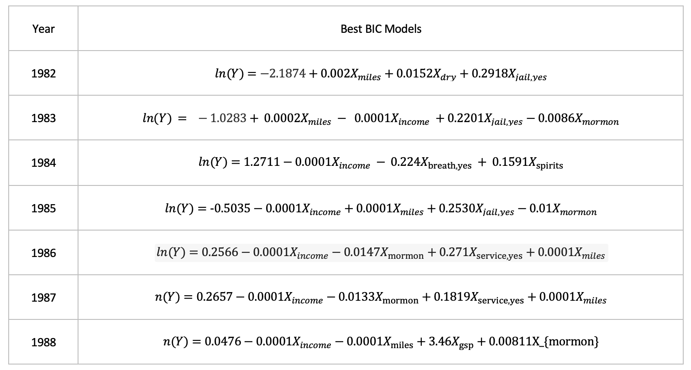

```{r setup, include=FALSE}
knitr::opts_chunk$set(echo = FALSE)
library(knitr)
```

```{r, echo = FALSE, message=FALSE, results = 'hide'}
library(ggplot2)
library(viridis)
library(AER)
library(MASS)
data(Fatalities)
head(Fatalities)
str(Fatalities)
dim(Fatalities)

Fatalities$afatal_rate <- Fatalities$afatal / Fatalities$pop * 10000
## different us regions
south = c("la","ms","al","ga","sc","ar","tx","fl","nc","tn","ar","ok","ky","wv","va")
n_east =  c("me","vt","nh","ma","ny","ri","ct","nj","de","md","pa")

Fatalities$location[Fatalities$state %in% south]  =  "south"
Fatalities$location[Fatalities$state %in% n_east] =  "north east"
Fatalities$location[!(Fatalities$state %in% n_east | Fatalities$state %in% south)]   =  "other"
str(Fatalities$location)
Fatalities$location = as.factor(Fatalities$location)
levels(Fatalities$location)

fatality.1982 = subset(Fatalities, year == "1982")
fatality.1983 = subset(Fatalities, year == "1983")
fatality.1984 = subset(Fatalities, year == "1984")
fatality.1985 = subset(Fatalities, year == "1985")
fatality.1986 = subset(Fatalities, year == "1986")
fatality.1987 = subset(Fatalities, year == "1987")
fatality.1988 = subset(Fatalities, year == "1988")

#year 1988 has some na values
which(is.na(fatality.1988$jail)) #observation 4 n in subset data, obs 28 in original data
fatality.1988[4,] #since it is categorical we cannot impute the data so we remove. 
#after running below line, comment out the line to avoid deleting more pts. 
fatality.1988 = fatality.1988[-c(which(is.na(fatality.1988$jail))),]
View(fatality.1988)
which(is.na(fatality.1988$jail))


model.1982 = lm(formula = afatal_rate ~ miles + dry + jail, data =fatality.1982)
model.1983 = lm(formula = afatal_rate ~ miles + income + drinkage + breath + gsp, data = fatality.1983)
model.1984 = lm(formula = afatal_rate ~ income + gsp + baptist, data = fatality.1984)
model.1985 = lm(formula = afatal_rate ~ income + miles + jail + mormon, data = fatality.1985)
model.1986 = lm(formula = afatal_rate ~ income + baptist + jail, data = fatality.1986)
model.1987 = lm(formula = afatal_rate ~ income + baptist, data = fatality.1987)
model.1988 = lm(formula = afatal_rate ~ income + baptist + spirits, data = fatality.1988)
```

## I. Model Selection\
In this section we are using stepwise regression for all subsets and a specific subset selection process to see which combination of explanatory variables will produce the best model based off of the criteria we have chosen to use which is BIC. There are many variables in our model and we must make sure the ones in our model are significant. We looked at the model chosen when using all subsets and then Forwards Backwards Selection.

#### A. Model Criteria\
Because our goal is to have a correct model, we are choosing only explanatory variables    which have a significant relationship with angina. This model may be smaller than ones which have the goal of prediction. For the purposes of this class AIC or BIC are often used as model selection criteria as they penalize large models. AIC may overfit correct models and BIC penalizes large models even more, so we chose to focus on BIC as we imagine if somebody is trying to see if a person has angina  they will really need the  result to be as correct as possible. We choose the model that lowers BIC the most.

#### A. Subset Selection\
Subset selection does not evaluate all possible models; however, it is faster and does not cost as much because not all subsets are calculated. We chose to use Forwards Backwards Selection because we want a correct model which means having a smaller one. Of course, underfitting a model is not ideal however between underfitting and overfitting, underfitting the model is more likely to achieve the smaller and often more correct model which Forwards Selection or Forwards Backwards Selection is more likely to do. Forwards Backwards Selection does not underfit as much as Forwards Selection though, so we used Forwards Backwards as our subset selection. These were the models with the lowest
BIC when looking at all possible models.


### II.  Diagnostics
Diagnostics are performed to evaluate how well the data meets the assumptions needed for multiple regression, which are that observations are independent, errors have constant variance and they are normally distributed. We will look at different tests for these assumptions, and find and remove outliers. Typically we would transform data to correct for non-normality, non-linearity, or non-constant variance if necessary. 

### A. Testing for Normality
###   1. QQ Plot
```{r}
plot_qq = function(M, y){
qqnorm(M$residuals, main = sprintf("QQPlot Year %s", y))
qqline(M$residuals)
}
par(mfrow = c(3,3))
plot_qq(model.1982, "1982")
plot_qq(model.1983,"1983")
plot_qq(model.1984, "1984")
plot_qq(model.1985, "1985")
plot_qq(model.1986, "1986")
plot_qq(model.1987, "1987")
plot_qq(model.1988, "1988")
```

The graphs above do not show normality, as they are heavy tailed. We will transform the data to try correcting for non-normality in the errors using the Box-Cox transformation with a lambda that maximizes the log likelihood of 0 which corresponds to a log transformation. 

```{r}
transformData = function(data){
  data$afatal_rate = log(data$afatal_rate)
  return(data)
}
new.transf.1982 = transformData(fatality.1982)
new.transf.1983 = transformData(fatality.1983)
new.transf.1984 = transformData(fatality.1984)
new.transf.1985 = transformData(fatality.1985)
new.transf.1986 = transformData(fatality.1986)
new.transf.1987 = transformData(fatality.1987)
new.transf.1988 = transformData(fatality.1988)
```


```{r,results = 'hide'}
get.best.model = function(data){
  
  droplevels(data$year)
  numNAs = sapply(data, function(x){length(which(is.na(x)))})
  
  #data$afatal_rate <- data$afatal / data$pop * 10000
  full.model = lm(afatal_rate ~ spirits + unemp + income + emppop + beertax +baptist+
                  mormon + drinkage + dry +  youngdrivers+ miles + breath + jail+service
                +milestot+unempus+emppopus+gsp, data = data)

  empty.model = lm(afatal_rate ~ 1, data = data)

  n= nrow(data)

  
  FB.model.BIC = stepAIC(empty.model,  scope = list(lower = empty.model, upper= full.model), k = log(n),trace=FALSE,direction = "both")
 
  fb = FB.model.BIC$call
  results=  list("na" = numNAs, "FB" = fb)
  return(results)
}

get.best.model(new.transf.1982)$FB
new.1982.model = lm(formula = afatal_rate ~ miles + dry + jail, data = new.transf.1982)
round(new.1982.model$coefficients,4)


get.best.model(new.transf.1983)$FB
new.1983.model = lm(formula = afatal_rate ~ miles + income + jail + mormon, data = new.transf.1983)
round(new.1983.model$coefficients,4)


get.best.model(new.transf.1984)$FB
new.1984.model = lm(formula = afatal_rate ~ income + breath + spirits, data = new.transf.1984)
round(new.1984.model$coefficients,4)

get.best.model(new.transf.1985)$FB
new.1985.model = lm(formula = afatal_rate ~ income + miles + jail + mormon, data = new.transf.1985)
round(new.1985.model$coefficients,4)

get.best.model(new.transf.1986)$FB
new.1986.model = lm(formula = afatal_rate ~ income + mormon + service + miles, 
    data = new.transf.1986)
round(new.1986.model$coefficients,4)

get.best.model(new.transf.1987)$FB
new.1987.model = lm(formula = afatal_rate ~ income + mormon + miles + service, 
    data = new.transf.1987)
round(new.1987.model$coefficients,4)

get.best.model(new.transf.1988)$FB
new.1988.model = lm(formula = afatal_rate ~ income + miles + gsp + mormon, data = new.transf.1988)
round(new.1988.model$coefficients,4)
```

```{r}
par(mfrow = c(3,3))
plot_qq(new.1982.model, "1982")
plot_qq(new.1983.model, "1983")
plot_qq(new.1984.model, "1984")
plot_qq(new.1985.model,"1985")
plot_qq(new.1986.model,"1986")
plot_qq(new.1987.model,"1987")
plot_qq(new.1988.model, "1988")
```

Transforming the data definitely helped adjust normality as the old p-value for the Shapiro-WIlks test was 1.775e-08 but now it is .7944 which clearly is greater than an alpha value of .05 so with the transformation we fail to reject the null and errors are approximately normal. With our new models, we evaluated the data’s influential points and outliers before proceeding. However we did not find any outliers.  Thus our final best models are:

```{r, echo = FALSE, out.width = '50%', fig.align="center"}

```


### R Appendix
```{r, ref.label=knitr::all_labels(),echo=TRUE,eval=FALSE}

```

  